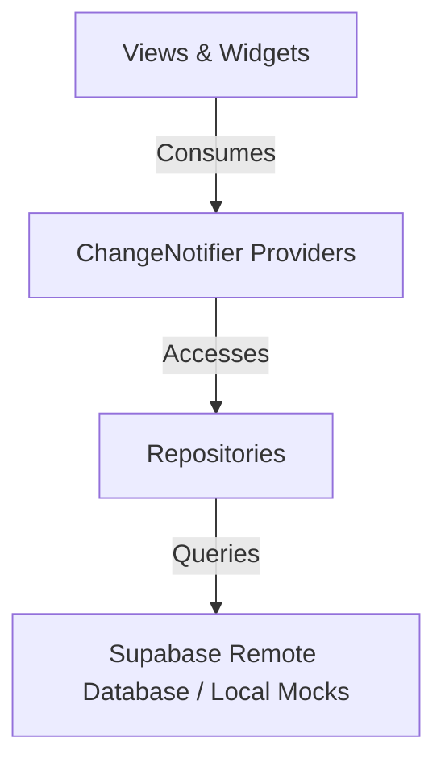

# Technical Architecture - FinalRep App

This document outlines the core architecture of the FinalRep Streetlifting application, highlighting the interaction between state management, database access, layouts, and routing.

---

## 1. Directory Structure

```
lib/
├── models/             # Domain data models (Profile, Competition, etc.)
├── providers/          # ChangeNotifier classes orchestrating application state
├── repositories/       # Direct Supabase database API layers
├── utils/              # Help/formatting utilities (including StreetliftingRulesEngine)
├── views/              # Main page views (Login, Register, Profile, Settings, etc.)
└── widgets/            # Reusable UI component blocks
```

---

## 2. Architecture Layers

The application conforms to a layered presentation-state-repository pattern:



### A. Repository Layer (Data Access)
- **[ProfileRepository](file:///Users/malikjannico/.gemini/antigravity/worktrees/finalrep-app/platform-features-update/lib/repositories/profile_repository.dart)**: Interacts with the `profiles` table. Handles querying by ID, email, and username, as well as updating profiles.
- **[CompetitionRepository](file:///Users/malikjannico/.gemini/antigravity/worktrees/finalrep-app/platform-features-update/lib/repositories/competition_repository.dart)**: Queries the `competitions` and `attempts` tables, handles real-time searches, location queries, flights, weigh-ins, and filtering by format.
- **[AssociationRepository](file:///Users/malikjannico/.gemini/antigravity/worktrees/finalrep-app/platform-features-update/lib/repositories/association_repository.dart)**: Manages associations, team member roles, and competition/athlete groups.
- **[AdminRepository](file:///Users/malikjannico/.gemini/antigravity/worktrees/finalrep-app/platform-features-update/lib/repositories/admin_repository.dart)**: Handles system administration configuration (sports, formats, disciplines) and user permission applications.
- **[NotificationRepository](file:///Users/malikjannico/.gemini/antigravity/worktrees/finalrep-app/platform-features-update/lib/repositories/notification_repository.dart)**: Manages reading and dismissing user notifications.

### B. State Management Layer (Providers)
- **[AuthProvider](file:///Users/malikjannico/.gemini/antigravity/worktrees/finalrep-app/platform-features-update/lib/providers/auth_provider.dart)**: Holds user authentication states, session tokens, notification settings, and active profile data.
- **[CompetitionProvider](file:///Users/malikjannico/.gemini/antigravity/worktrees/finalrep-app/platform-features-update/lib/providers/competition_provider.dart)**: Manages list state, sorting metrics, active filtering parameters, and layout settings (e.g. grid vs. list) for competition feeds, as well as managing active competition execution state (timer, attempts, judge voting).

### C. Presentation Layer (Views & Widgets)
- **Direct Background Rendering**: Core user profile screens and settings menus are rendered directly onto the app's scaffold background color rather than nested inside `Card` layers.
- **Desktop Sub-Navigation & Inline Details**: The main desktop shell displays a sub-navigation bar. Activating the "My Profile" tab loads the profile inline under the header rather than performing a push route.
- **Responsive Mobile Components**:
  - **Navigation Drawer**: Houses user information and bottom-aligned logout options.
  - **Search UX**: Adapts depending on active search view.

---

## 3. Key Flows & Integration Points

### Streetlifting Modern Rules Engine
- Handles Muscle Up, Pull Up, Dip, and Squat lifts under ascending weight orders.
- Evaluates majority (2:1 for dip/squat depth) vs unanimous (3:0 for other lift rules) decisions.
- Manages platform execution clocks and VAR tokens.
- **FinalRep Underground:** This competition group exists **exclusively in the Modern format** across all components (mock repos, tests, and Supabase database). All Classic representations have been removed.

### Password Recovery Flow
1. **Trigger**: An unauthenticated user requests a password reset from the [LoginPage](file:///Users/malikjannico/.gemini/antigravity/worktrees/finalrep-app/platform-features-update/lib/views/login_page.dart).
2. **Deep Link Ingestion**: The Supabase client monitors deep links. When the user opens the recovery email link, the client raises `AuthChangeEvent.passwordRecovery`.
3. **UI Interception**: [SearchFeedPage](file:///Users/malikjannico/.gemini/antigravity/worktrees/finalrep-app/platform-features-update/lib/views/search_feed_page.dart) listens for `AuthProvider.isPasswordRecoveryActive`. When `true`, it displays a modal dialog forcing the user to create a new password.
