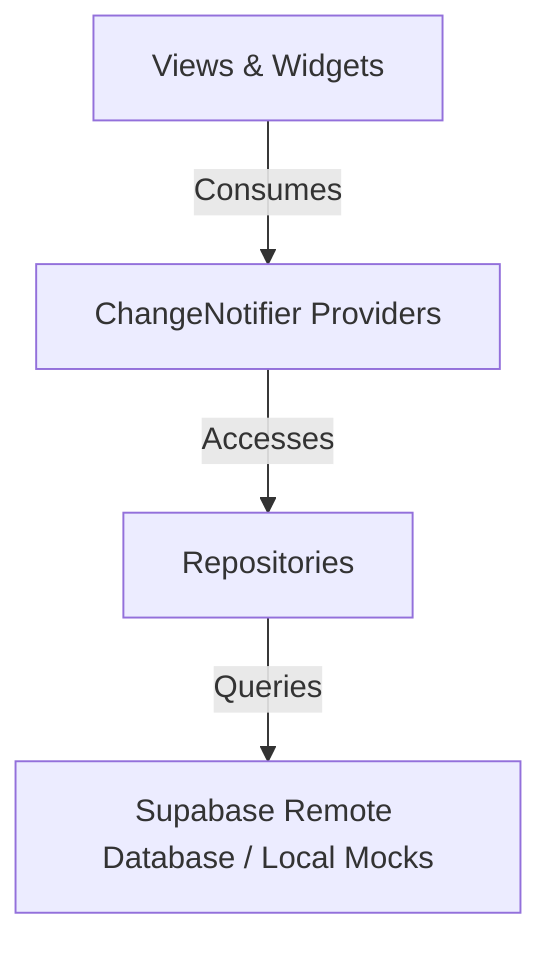

# Technical Architecture - FinalRep App

This document outlines the core architecture of the FinalRep Streetlifting application, highlighting the interaction between state management, database access, layouts, and routing.

---

## 1. Directory Structure

```
lib/
├── models/             # Domain data models (Profile, Competition, etc.)
├── providers/          # ChangeNotifier classes orchestrating application state
├── repositories/       # Direct Supabase database API layers
├── utils/              # Help/formatting utilities
├── views/              # Main page views (Login, Register, Profile, Settings, etc.)
└── widgets/            # Reusable UI component blocks
```

---

## 2. Architecture Layers

The application conforms to a layered presentation-state-repository pattern:



### A. Repository Layer (Data Access)
- **[ProfileRepository](file:///Users/malikjannico/.gemini/antigravity/worktrees/finalrep-app/refactor-user-profile-settings/lib/repositories/profile_repository.dart)**: Interacts with the `profiles` table. Handles querying by ID, email, and username, as well as updating profiles.
- **[CompetitionRepository](file:///Users/malikjannico/.gemini/antigravity/worktrees/finalrep-app/refactor-user-profile-settings/lib/repositories/competition_repository.dart)**: Queries the `competitions` table for upcoming meets, handles real-time searches, location queries, and filtering by format (Classic vs. Modern).

### B. State Management Layer (Providers)
- **[AuthProvider](file:///Users/malikjannico/.gemini/antigravity/worktrees/finalrep-app/refactor-user-profile-settings/lib/providers/auth_provider.dart)**: Holds user authentication states, session tokens, and active profile data. Emits updates on auth changes, checks email/username availability, triggers recovery triggers, and handles updates to user details or profile photos.
- **[CompetitionProvider](file:///Users/malikjannico/.gemini/antigravity/worktrees/finalrep-app/refactor-user-profile-settings/lib/providers/competition_provider.dart)**: Manages list state, sorting metrics, active filtering parameters, and layout settings (e.g. grid vs. list) for competition feeds.

### C. Presentation Layer (Views & Widgets)
- **Direct Background Rendering**: In keeping with design guidelines, core user profile screens and settings menus are rendered directly onto the app's scaffold background color rather than nested inside `Card` layers.
- **Desktop Sub-Navigation & Inline Details**: The main desktop shell displays a sub-navigation bar. Activating the "My Profile" tab loads the profile inline under the header rather than performing a push route, and typing any search query automatically closes this inline view to focus on query results.
- **Responsive Mobile Components**:
  - **Navigation Drawer**: Houses user information and positions the Logout action at the very bottom below a `Spacer`.
  - **Search UX**: Adapts depending on active search view (stacking username/full name vertically in list layouts, displaying top banner fallbacks in grid widgets, and removing right-aligned arrow indicators).

---

## 3. Key Flows & Integration Points

### Password Recovery Flow
1. **Trigger**: An unauthenticated user requests a password reset from the [LoginPage](file:///Users/malikjannico/.gemini/antigravity/worktrees/finalrep-app/refactor-user-profile-settings/lib/views/login_page.dart) or an authenticated user requests a reset email from the [ChangePasswordPage](file:///Users/malikjannico/.gemini/antigravity/worktrees/finalrep-app/refactor-user-profile-settings/lib/views/change_password_page.dart).
2. **Deep Link Ingestion**: The Supabase client monitors deep links. When the user opens the recovery email link, the client raises `AuthChangeEvent.passwordRecovery`.
3. **UI Interception**: [SearchFeedPage](file:///Users/malikjannico/.gemini/antigravity/worktrees/finalrep-app/refactor-user-profile-settings/lib/views/search_feed_page.dart) listens for `AuthProvider.isPasswordRecoveryActive`. When `true`, it displays a modal dialog forcing the user to create a new password. The dialog validates the 5 password security rules, enables the strength bar indicator, and commits the updated credentials back to Supabase.
